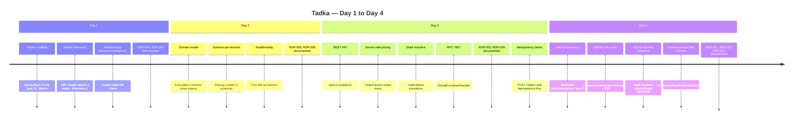

# Day 1 — Evolution Timeline

From a blank project to a running API with liveness and readiness.

```mermaid
timeline
    title Tadka — Day 1 to Day 4
    section Day 1
        Project scaffold : Spring Boot 3.5.16, Java 21, Maven
        /health (liveness) : GET /health returns { status, timestamp }
        /health/ready (liveness+readiness) : Copilot adds DB check
        ADR-001, ADR-002 documented
    section Day 2
        Domain model : 5 bounded contexts, value objects
        Schema-per-domain : Flyway creates 5 schemas
        /health/ready : First DB connection
        ADR-003, ADR-008 documented
    section Day 3
        REST API : /api/v1 endpoints
        Server-side pricing : OrderFactory reads menu
        State machine : OrderStatus transitions
        RFC 7807 : GlobalExceptionHandler
        ADR-005, ADR-009 documented
        Idempotency demo : POST /orders with Idempotency-Key
    section Day 4
        xmin concurrency : @Version @Column(name="xmin")
        409 for lost races : OptimisticLockingFailureException → 409
        422 for domain violations : State machine rejects illegal transitions
        Domain events after commit : TransactionSynchronizationManager
        ADR-011, ADR-012, ADR-013 documented
```
