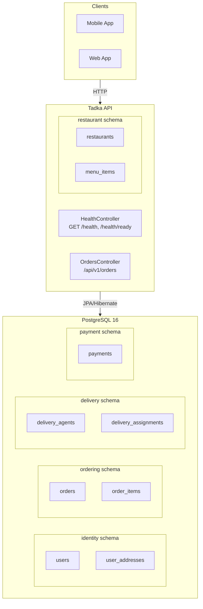

# Day 1 — Final Architecture

The target architecture for the Tadka platform: one Spring Boot API, one PostgreSQL 16 database, five schemas.

**Key properties:**
- Single deployable (`docker compose up`)
- Five schemas for five bounded contexts
- No cross-schema FKs (ADR-008)
- Value objects (`Money`, `Address`) stored as columns, not separate tables
- `/health` = liveness, `/health/ready` = readiness with DB check
