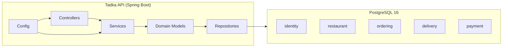

# Day 1 — Monolith Architecture

The Tadka platform starts as a monolith (ADR-002). One Spring Boot application, one database, one compose file.

**Why monolith first:**
- Single deployable — `docker compose up`
- No network calls between domains
- Transactional boundaries are straightforward
- Easy to refactor into services later

**Future extraction points:**
- `ordering` → order service
- `restaurant` → restaurant service
- `delivery` → delivery service
- `payment` → payment service
- `identity` → identity/auth service
