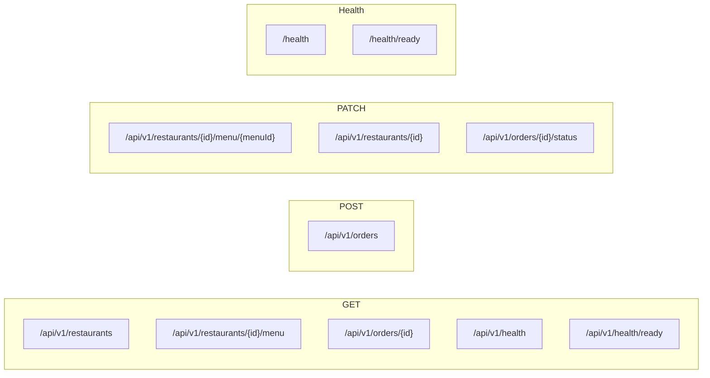

# Day 3 — API Route Map

All REST endpoints introduced on Day 3.

| Method | Path | Description |
|--------|------|-------------|
| GET | `/api/v1/restaurants` | List all restaurants |
| GET | `/api/v1/restaurants/{id}/menu` | Get restaurant menu |
| GET | `/api/v1/orders/{id}` | Get order by ID |
| POST | `/api/v1/orders` | Place a new order |
| PATCH | `/api/v1/restaurants/{id}/menu/{menuId}` | Update menu item price |
| PATCH | `/api/v1/restaurants/{id}` | Update restaurant (deactivate) |
| PATCH | `/api/v1/orders/{id}/status` | Transition order status |
