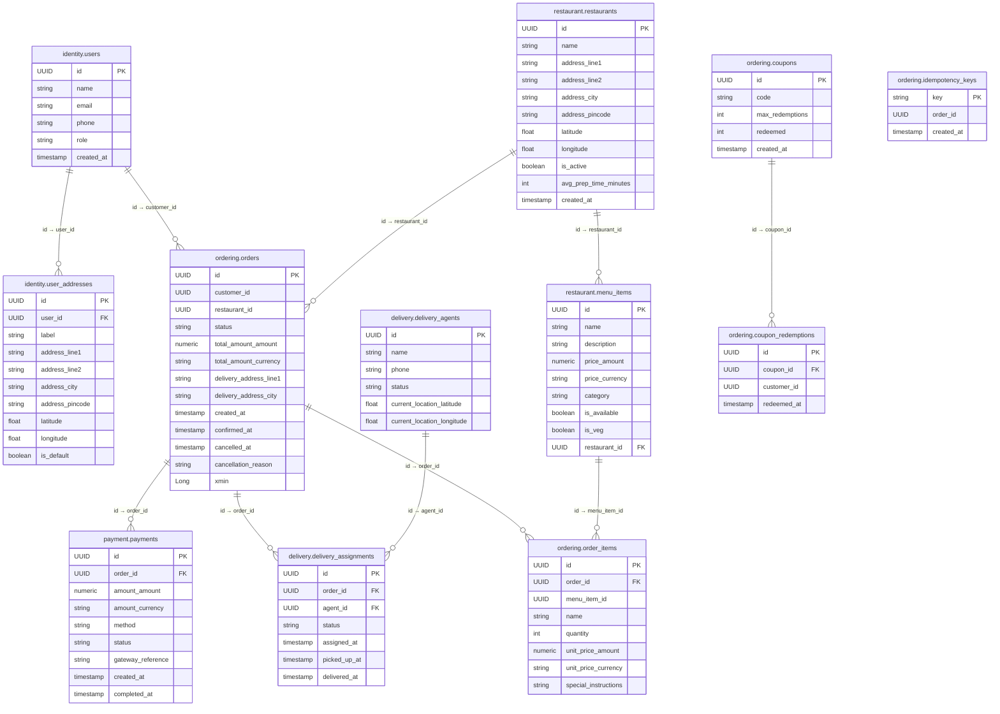

# Day 3 — ER Diagram

Entity-relationship diagram for the Tadka domain model. All schemas are in a single PostgreSQL 16 database.

```mermaid
erDiagram
    identity.users ||--o{ identity.user_addresses : "id → user_id"
    restaurant.restaurants ||--o{ restaurant.menu_items : "id → restaurant_id"
    identity.users ||--o{ ordering.orders : "id → customer_id"
    restaurant.restaurants ||--o{ ordering.orders : "id → restaurant_id"
    ordering.orders ||--o{ ordering.order_items : "id → order_id"
    restaurant.menu_items ||--o{ ordering.order_items : "id → menu_item_id"
    ordering.orders ||--o{ delivery.delivery_assignments : "id → order_id"
    delivery.delivery_agents ||--o{ delivery.delivery_assignments : "id → agent_id"
    ordering.orders ||--o{ payment.payments : "id → order_id"
    ordering.coupons ||--o{ ordering.coupon_redemptions : "id → coupon_id"

    identity.users {
        UUID id PK
        string name
        string email
        string phone
        string role
        timestamp created_at
    }
    identity.user_addresses {
        UUID id PK
        UUID user_id FK
        string label
        string address_line1
        string address_line2
        string address_city
        string address_pincode
        float latitude
        float longitude
        boolean is_default
    }
    restaurant.restaurants {
        UUID id PK
        string name
        string address_line1
        string address_line2
        string address_city
        string address_pincode
        float latitude
        float longitude
        boolean is_active
        int avg_prep_time_minutes
        timestamp created_at
    }
    restaurant.menu_items {
        UUID id PK
        string name
        string description
        numeric price_amount
        string price_currency
        string category
        boolean is_available
        boolean is_veg
        UUID restaurant_id FK
    }
    ordering.orders {
        UUID id PK
        UUID customer_id
        UUID restaurant_id
        string status
        numeric total_amount_amount
        string total_amount_currency
        string delivery_address_line1
        string delivery_address_city
        timestamp created_at
        timestamp confirmed_at
        timestamp cancelled_at
        string cancellation_reason
        Long xmin
    }
    ordering.order_items {
        UUID id PK
        UUID order_id FK
        UUID menu_item_id
        string name
        int quantity
        numeric unit_price_amount
        string unit_price_currency
        string special_instructions
    }
    delivery.delivery_agents {
        UUID id PK
        string name
        string phone
        string status
        float current_location_latitude
        float current_location_longitude
    }
    delivery.delivery_assignments {
        UUID id PK
        UUID order_id FK
        UUID agent_id FK
        string status
        timestamp assigned_at
        timestamp picked_up_at
        timestamp delivered_at
    }
    payment.payments {
        UUID id PK
        UUID order_id FK
        numeric amount_amount
        string amount_currency
        string method
        string status
        string gateway_reference
        timestamp created_at
        timestamp completed_at
    }
    ordering.coupons {
        UUID id PK
        string code
        int max_redemptions
        int redeemed
        timestamp created_at
    }
    ordering.coupon_redemptions {
        UUID id PK
        UUID coupon_id FK
        UUID customer_id
        timestamp redeemed_at
    }
    ordering.idempotency_keys {
        string key PK
        UUID order_id
        timestamp created_at
    }
```
