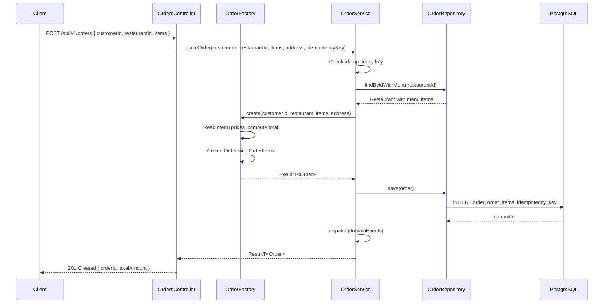

# Day 3 — Request Flow

The full request flow for placing an order.

**Key points:**
- Server-side pricing via `OrderFactory.create()`
- Idempotency key checked in same transaction as the order
- Domain events dispatched after commit (ADR-013)
- `xmin` on `orders` enables optimistic concurrency (ADR-012)
