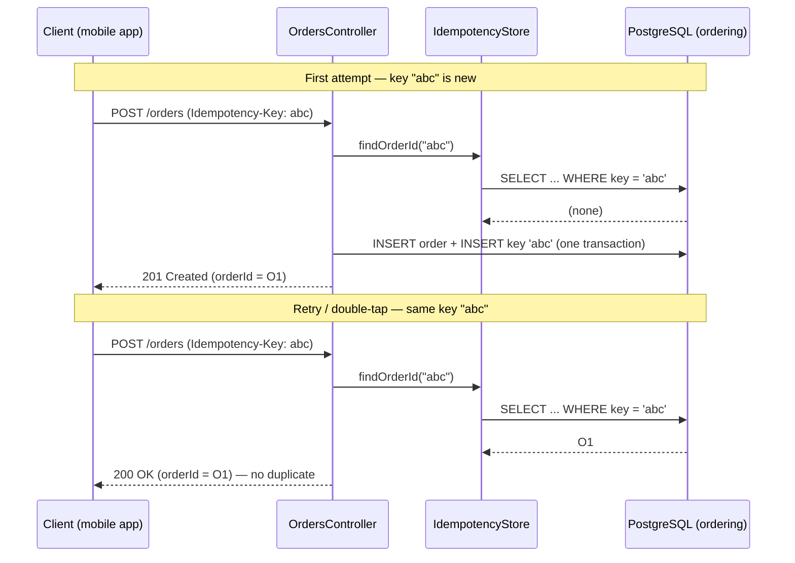
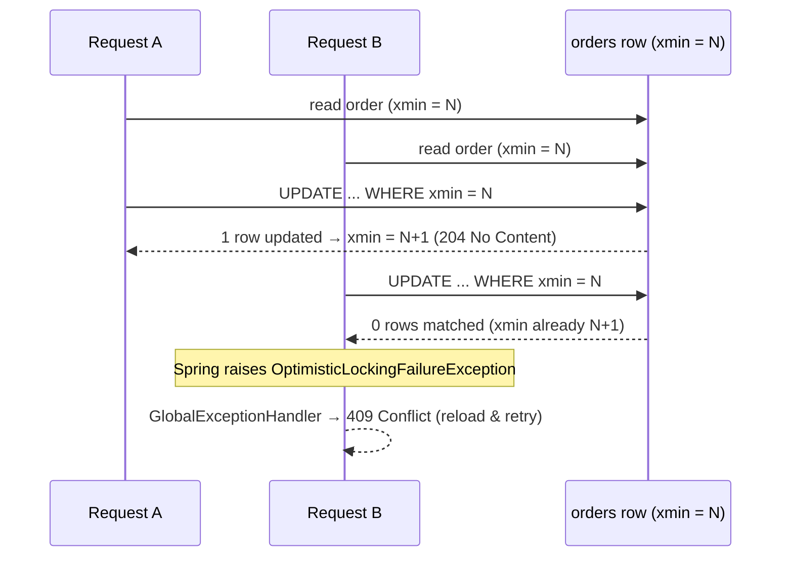

# Day 4 — Order-Flow Hardening (diagrams)

Three failure-first hardenings of the Day-3 order flow. Each diagram shows the *break* and the *fix*.
See ADR-011 (idempotency), ADR-012 (optimistic concurrency), ADR-013 (in-process domain events).

---

## 1. Idempotency — safe retries on `POST /orders` (ADR-011)

Without a key, a retry creates a duplicate. With a reused `Idempotency-Key`, the replay returns the original order.



---

## 2. Optimistic concurrency — the lost-update race (ADR-012)

Two writers read the same order version; `xmin` lets exactly one commit. The loser gets `409`.



> When the two requests *serialise* instead of truly overlapping, the second simply re-reads the already-`CONFIRMED` order and the **state machine** rejects it with `422`. Either way there is no lost update: the order is confirmed exactly once.

---

## 3. In-process domain events — dispatch AFTER persistence (ADR-013)

The transition is committed first; side-effects run afterwards and cannot roll it back.

```mermaid
sequenceDiagram
    participant API as OrdersController
    participant O as Order (aggregate)
    participant DB as PostgreSQL
    participant D as DomainEventDispatcher
    participant H as OrderConfirmedNotificationHandler

    API->>O: transition(Confirmed)
    O->>O: status = CONFIRMED; raise(OrderConfirmedEvent)
    API->>DB: save()  (state committed)
    DB-->>API: ok
    API->>D: dispatch(order.domainEvents)
    D->>H: handle(OrderConfirmedEvent)
    H-->>D: notification sent (logged)
    Note over API,H: A handler failure here does NOT undo the committed transition.
    Note over D,H: Week 5: dispatcher → Kafka producer, handler → consumer in another service.
```
